# 核心交互流程图 — interaction_flow.md

> 阶段：04_core_interaction_design | 状态：有效
>
> ## 变更记录
> | 日期 | 变更内容 | Agent |
> |------|---------|-------|
> | 2026-04-01 | 初始版本，覆盖三大功能的正常路径与异常路径 | interaction-design-agent |

---

> **约定**：流程图使用 Mermaid 语法。实线 `-->` 为正常路径，虚线 `-.->` 为异常/可选路径。
> 系统行为用方括号 `[]` 表示，用户行为用圆角矩形表示。

---

## 一、认证流程

### 1.1 注册/登录

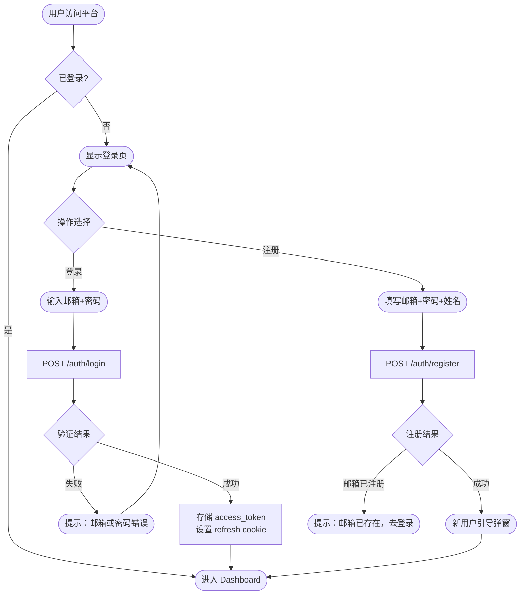

### 1.2 Token 刷新（静默，用户无感知）

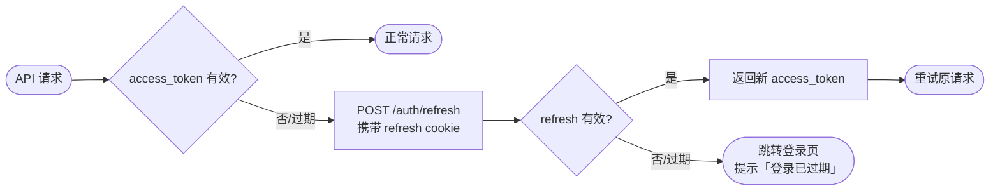

---

## 二、功能1：简历优化流程

### 2.1 主流程（含正常路径与异常路径）

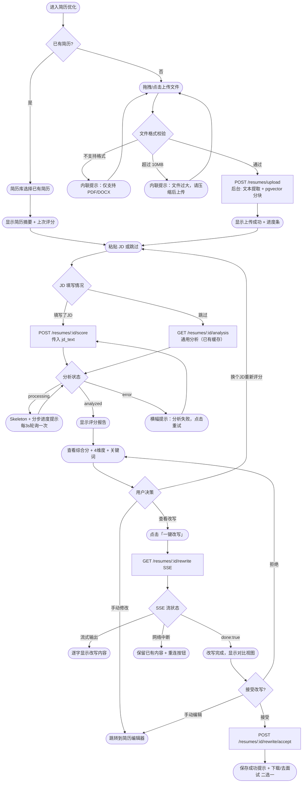

### 2.2 评分报告页内部交互

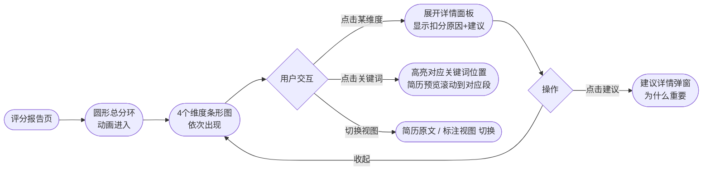

---

## 三、功能2：模拟面试流程

### 3.1 会话配置流程

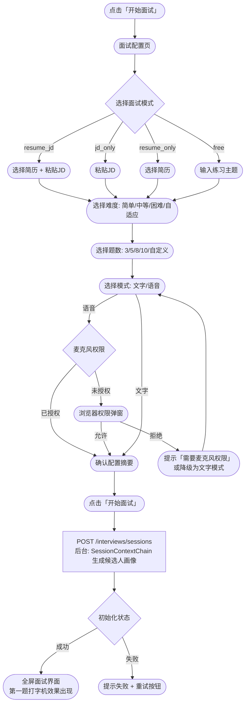

### 3.2 单题问答循环（文字模式）

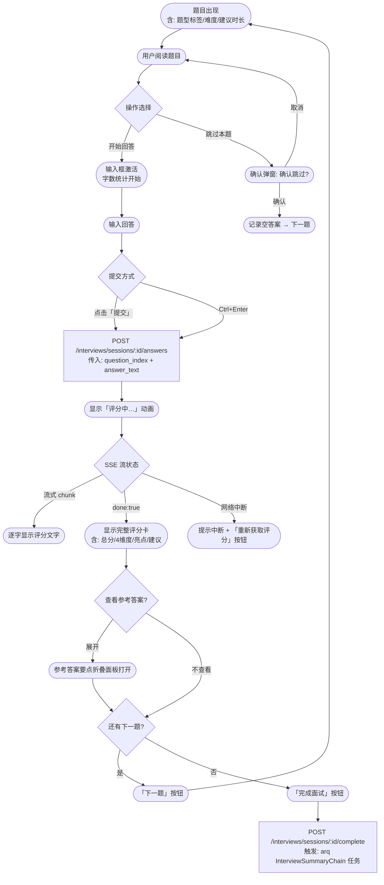

### 3.3 单题问答循环（语音模式）

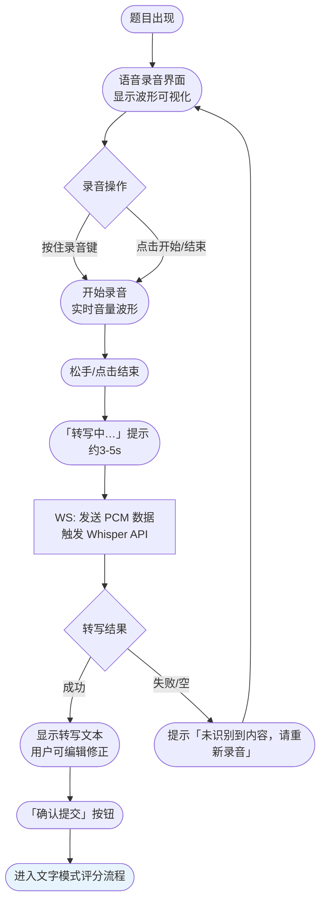

### 3.4 自适应难度调整（静默）

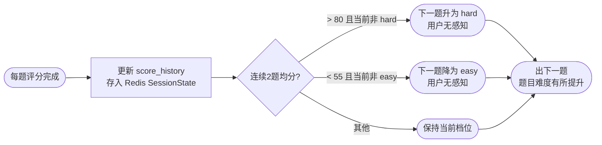

### 3.5 面试报告查看流程

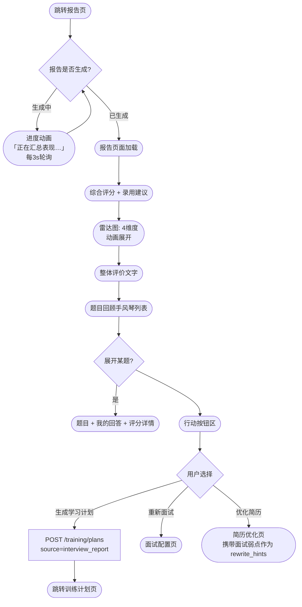

---

## 四、功能3：知识缺口训练流程

### 4.1 训练计划初始化流程

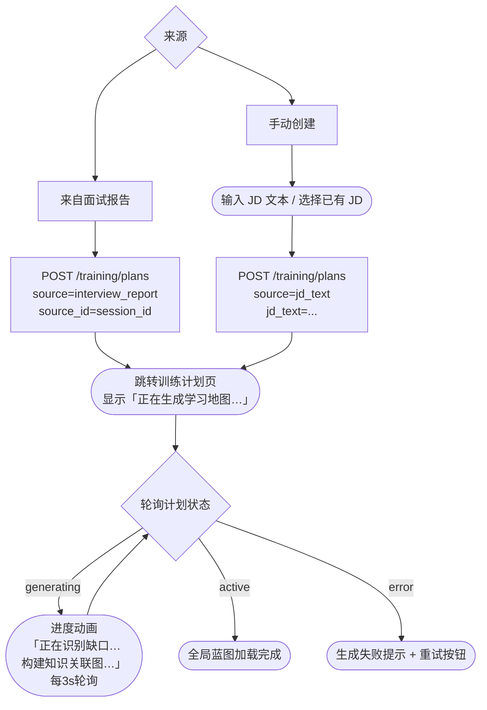

### 4.2 全局蓝图交互流程

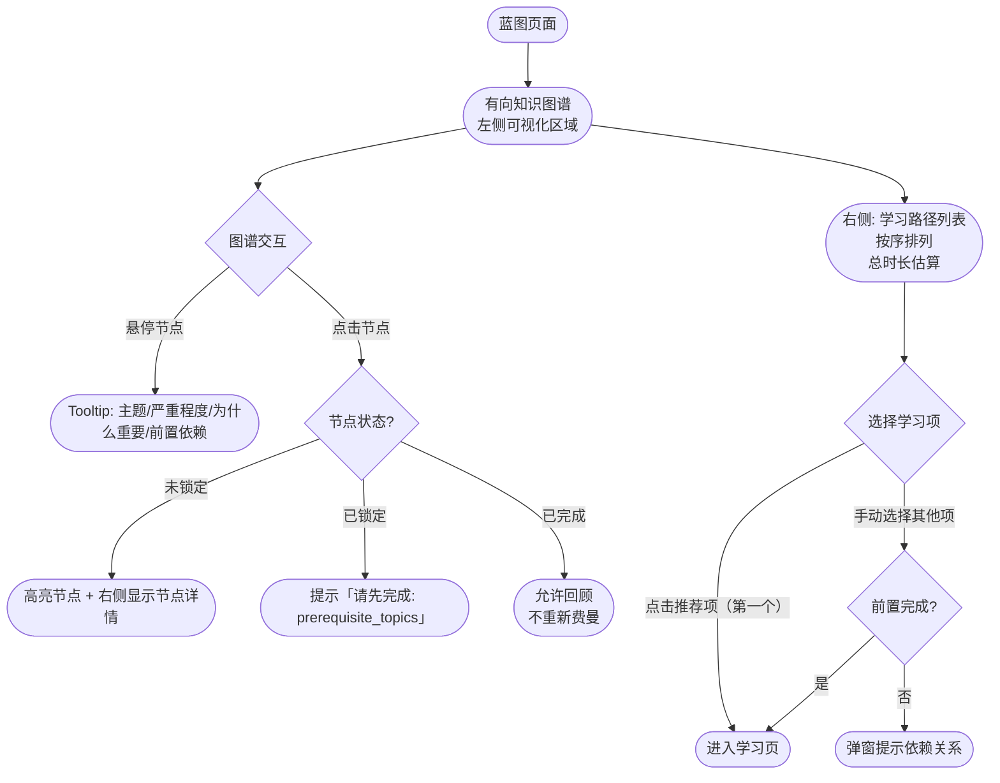

### 4.3 单知识点学习流程

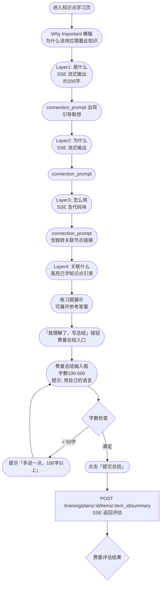

### 4.4 费曼检验循环

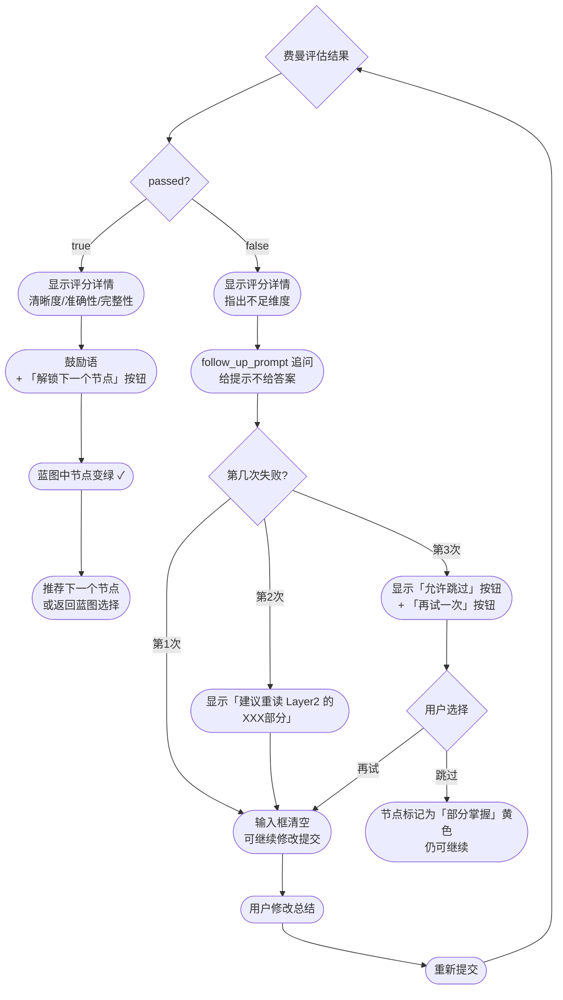

### 4.5 复测流程

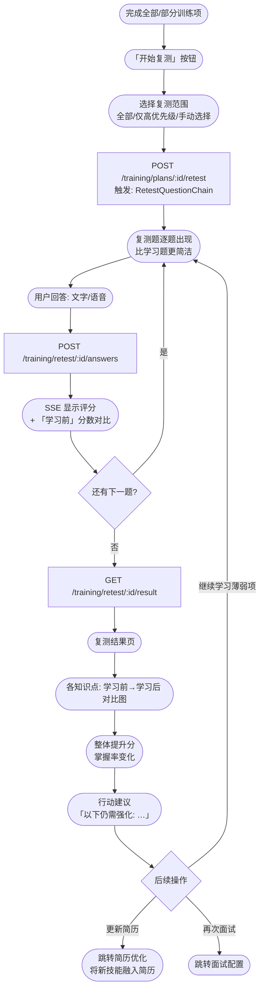

---

## 五、通知与后台任务反馈流程

### 5.1 arq 任务完成通知

后台长任务（简历分析、面试报告生成、训练计划生成）完成后，通过 Redis pub/sub → WebSocket 推送通知：

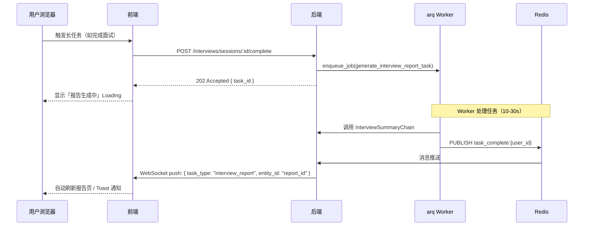

### 5.2 全局通知 WebSocket 连接

```
用户登录后 → 建立 WS /ws/notifications → 保持心跳 → 接收任务完成事件
用户切换页面 → WS 保持（不断开）
用户登出 → 关闭 WS
网络断开 → 自动重连（指数退避: 1s/2s/4s/8s）
```

---

## 六、页面级加载与错误边界

### 6.1 路由级加载策略

| 页面 | 加载策略 | 说明 |
|------|---------|------|
| `/login`, `/register` | 立即加载 | 核心入口，不懒加载 |
| `/dashboard` | 立即加载 | 登录后首屏 |
| `/resumes/:id/optimize` | 懒加载 | 按需加载 ScorePanel、DiffViewer |
| `/interviews/:id/session` | 懒加载 | 面试中不允许后台刷新 |
| `/training/:id` | 懒加载 | 知识图谱组件较重 |

### 6.2 错误边界处理

| 错误场景 | 展示位置 | 恢复方式 |
|---------|---------|---------|
| 页面级 JS 错误 | 全屏 ErrorBoundary | 刷新按钮 |
| API 401 未授权 | 自动跳转登录 | — |
| API 404 资源不存在 | 页面内提示 | 返回列表 |
| API 500 服务端错误 | Toast + 稍后重试 | 重试按钮 |
| SSE 连接失败 | 内联提示 | 重试按钮（保留已有内容）|
| WS 连接失败 | 面试中显示 Banner | 自动重连 |
| LLM 响应超时（>60s）| Toast 提示 | 重试按钮 |
