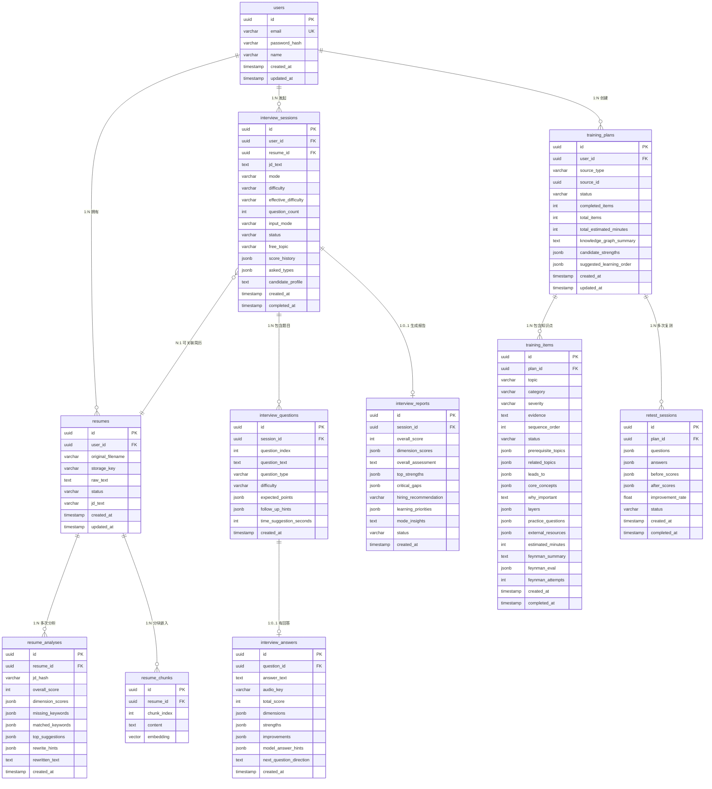

# 实体关系图 — erd.md

> 阶段：07_data_model | 状态：有效
>
> ## 变更记录
> | 日期 | 变更内容 | Agent |
> |------|---------|-------|
> | 2026-04-01 | 初始版本，覆盖全部 11 张核心表 | data-model-agent |

---

## 一、实体总览

| # | 实体 | 表名 | 核心职责 |
|---|------|------|---------|
| 1 | 用户 | `users` | 认证主体，所有业务数据的归属根节点 |
| 2 | 简历 | `resumes` | 原始简历存储与状态管理 |
| 3 | 简历分析 | `resume_analyses` | 针对特定 JD 的评分结果与改写内容 |
| 4 | 简历向量块 | `resume_chunks` | 简历分块嵌入，pgvector 检索 |
| 5 | 面试会话 | `interview_sessions` | 面试配置与运行时元信息 |
| 6 | 面试题目 | `interview_questions` | 每道题目及其评分要点 |
| 7 | 面试回答 | `interview_answers` | 用户回答 + 单题评分 |
| 8 | 面试报告 | `interview_reports` | 面试汇总评估（arq 后台生成） |
| 9 | 训练计划 | `training_plans` | 知识缺口训练的总计划 |
| 10 | 训练项目 | `training_items` | 单个知识点的学习内容与状态 |
| 11 | 复测记录 | `retest_sessions` | 学习前后的对比测评 |

---

## 二、ER 关系图（Mermaid）



---

## 三、关系说明

### 3.1 一对多关系

| 父表 | 子表 | 外键 | 级联删除 | 说明 |
|------|------|------|---------|------|
| `users` | `resumes` | `resumes.user_id` | CASCADE | 删除用户时级联删除其全部简历 |
| `users` | `interview_sessions` | `interview_sessions.user_id` | CASCADE | 同上 |
| `users` | `training_plans` | `training_plans.user_id` | CASCADE | 同上 |
| `resumes` | `resume_analyses` | `resume_analyses.resume_id` | CASCADE | 删除简历时级联删除分析 |
| `resumes` | `resume_chunks` | `resume_chunks.resume_id` | CASCADE | 删除简历时级联删除向量块 |
| `interview_sessions` | `interview_questions` | `interview_questions.session_id` | CASCADE | 删除会话时级联删除题目 |
| `training_plans` | `training_items` | `training_items.plan_id` | CASCADE | 删除计划时级联删除训练项 |
| `training_plans` | `retest_sessions` | `retest_sessions.plan_id` | CASCADE | 删除计划时级联删除复测 |

### 3.2 一对一关系

| 父表 | 子表 | 说明 |
|------|------|------|
| `interview_questions` | `interview_answers` | 每道题最多一个回答 |
| `interview_sessions` | `interview_reports` | 每次会话最多一份报告 |

### 3.3 可选外键

| 子表 | 外键 | 说明 |
|------|------|------|
| `interview_sessions.resume_id` | `resumes.id` | 可为 NULL（jd_only / free 模式不需要简历）|
| `training_plans.source_id` | 多态引用 | `source_type=interview_report` 时指向 `interview_reports.id`；`source_type=jd_only` 时为 NULL |

---

## 四、状态枚举

### 4.1 简历状态（`resumes.status`）

```
pending → analyzing → analyzed
                   ↘ failed
```

| 状态 | 含义 |
|------|------|
| `pending` | 已上传，等待 arq worker 提取文本 |
| `analyzing` | arq worker 正在处理（提取 + 嵌入 + 评分）|
| `analyzed` | 分析完成，可查看评分报告 |
| `failed` | 分析失败（文件格式错误、LLM 异常等）|

### 4.2 面试会话状态（`interview_sessions.status`）

```
created → in_progress → completed → report_generating → report_ready
                                 ↘ report_failed
```

| 状态 | 含义 |
|------|------|
| `created` | 刚创建，第一题已生成，等待用户开始 |
| `in_progress` | 面试进行中 |
| `completed` | 用户点击结束，等待生成报告 |
| `report_generating` | arq worker 正在生成汇总报告 |
| `report_ready` | 报告生成完成 |
| `report_failed` | 报告生成失败 |

### 4.3 训练计划状态（`training_plans.status`）

```
generating → active → completed
          ↘ failed
```

| 状态 | 含义 |
|------|------|
| `generating` | arq worker 正在运行 BlueprintChain |
| `active` | 蓝图生成完成，用户可开始学习 |
| `completed` | 所有知识点学习完成 |
| `failed` | 蓝图生成失败 |

### 4.4 训练项目状态（`training_items.status`）

```
locked → pending → in_progress → feynman_pending → completed
                                                 ↗ (解锁依赖)
```

| 状态 | 含义 |
|------|------|
| `locked` | 前置依赖未完成，不可开始 |
| `pending` | 已解锁，等待用户开始学习 |
| `in_progress` | 用户正在学习 4 层内容 |
| `feynman_pending` | 4 层内容已读完，等待费曼总结 |
| `completed` | 费曼通过（或 3 次后跳过），学习完成 |
